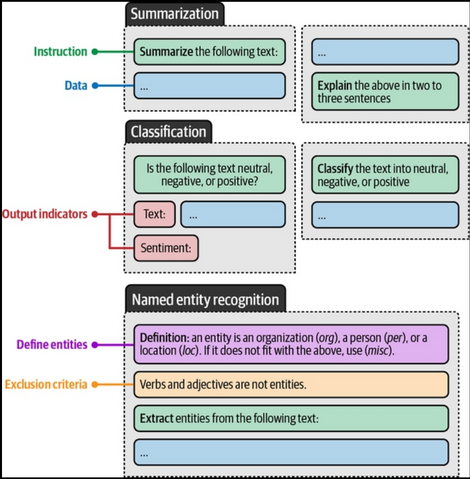
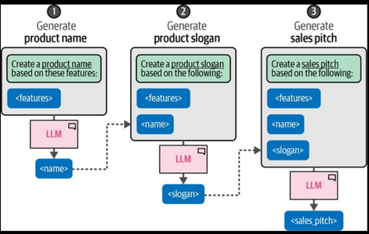
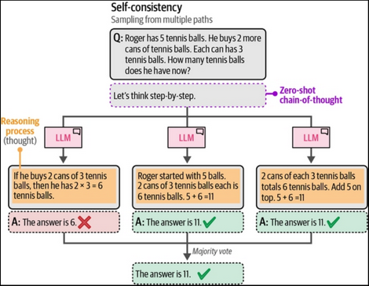

# Chapter 6 - Prompt Engineering
My notes.

### Temperature
Controls the randonmness or creativity.
- 0: gerenates the same response, choose the most likely word
- lower (0.2) for more deterministic output
- higher (0.8) more diverse and creative
- introduce stochastic behavior

### top_p - nucleus sampling
- sampling technique that controls wich subset of tokens (nucleus) the LLM can consider
- top_p = 0.1, consider tokens until reaches that value
- top_p = 1, consider all tokens

We can combine each of those parameters for control the output of our LLM. 

Use cases:
- brainstorming: high temperature, high top_p
- email-generation: low temperatura, low top_p
- creative writing: high temperature, low top_p
- translation: low temperature, high top_p

## Prompts
Basically are:
- questions
- statements or
- instructions

Basic prompt: 
Input > LLM > Output

### Instruction-based prompting
- have the llm answer a specific question or resolve a certain task

Components of complex prompting:
- persona: the role
- instruction: the task
- context: - additional information about the problem or task
- format: the output format
- audience: the target of the generated text
- tone: the tone of voice
- data: the data related to the task

You can try many itterations over modular components.

You can be as creative as possible:
- use emotional stimuli: "this is very important for my job"
- different models for different purposes

**Zero-shot prompt**

Prompting without examples

    Classify the text into neutral, negative, or positive.

    Text: The service was really slow. Sentiment: ...

**One-shot prompt**

Prompting with a single example

    Classify the text into neutral, negative, or positive.

    Text: The movie was fine. Sentiment: Neutral.

    Text: The performance was outstanding. Sentiment:

**Few-shot prompt**

Prompting with more than one example

    Classify the text into neutral, negative, or positive.

    Text: The product broke after one day. Sentiment: Negative.

    Text: This is the best purchase I've ever made! Sentiment: Positive.

    Text: The shirt fits as expected. Sentiment: Neutral.

    Text: The laptop is very fast, but the battery life is short. Sentiment:

### Chaining prompts
- allows llm to spend more time on individual question instead of tackling the whole problem
- more calls to the model but we can give different parameters for each one
- we can use the generated output as input

## Reasoning

### Chain-of-Thought
- think before answering
- 'let's think step-by-step'

### Self-consistency
- sampling outputs
- multiple reasoning paths
- ask the same prompt multiple times and take the majority result as final answer

### Tree-of-Thought
- tree-based structure
- generate intemediate thoughts to be rated
- the most promising are kept and the lowest are pruned
- we can emulate a conversation between multiple experts

## Evaluate outputs
- expected format
- if the output follows out rules
